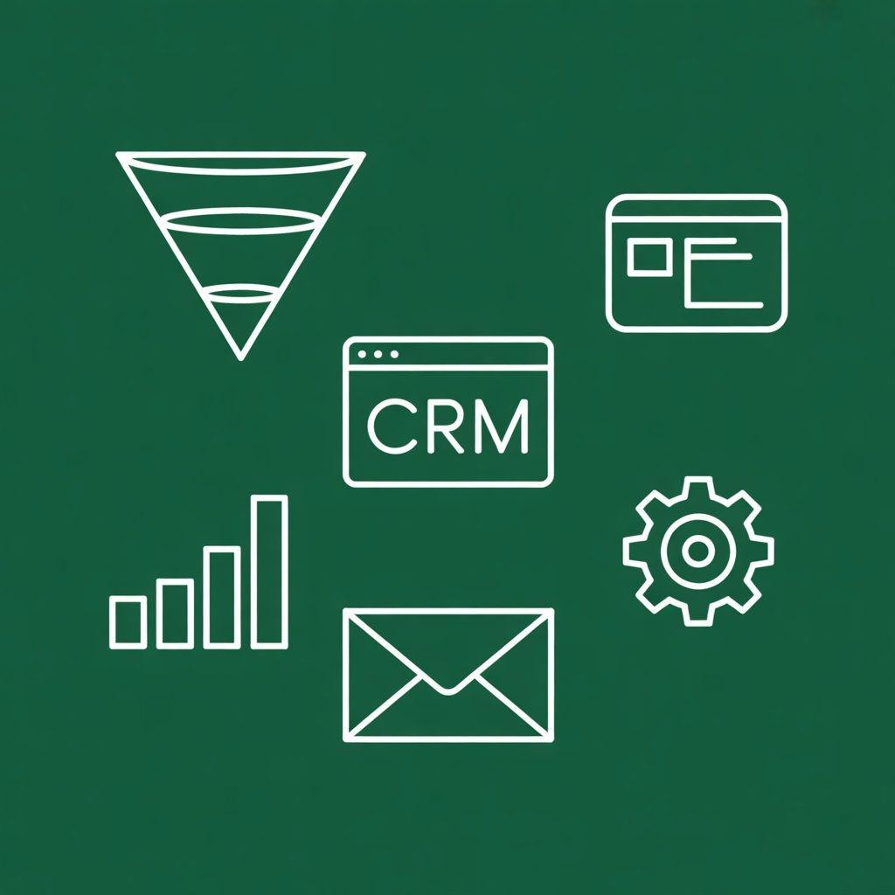
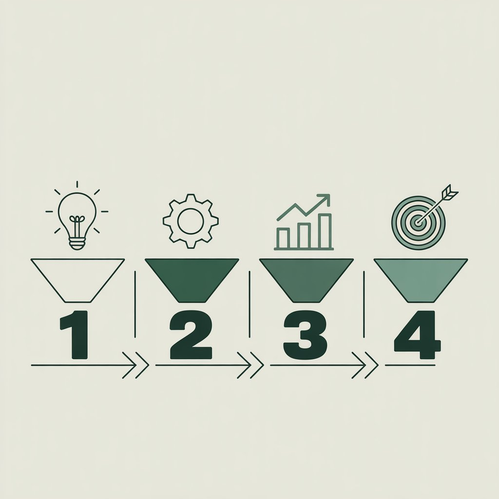
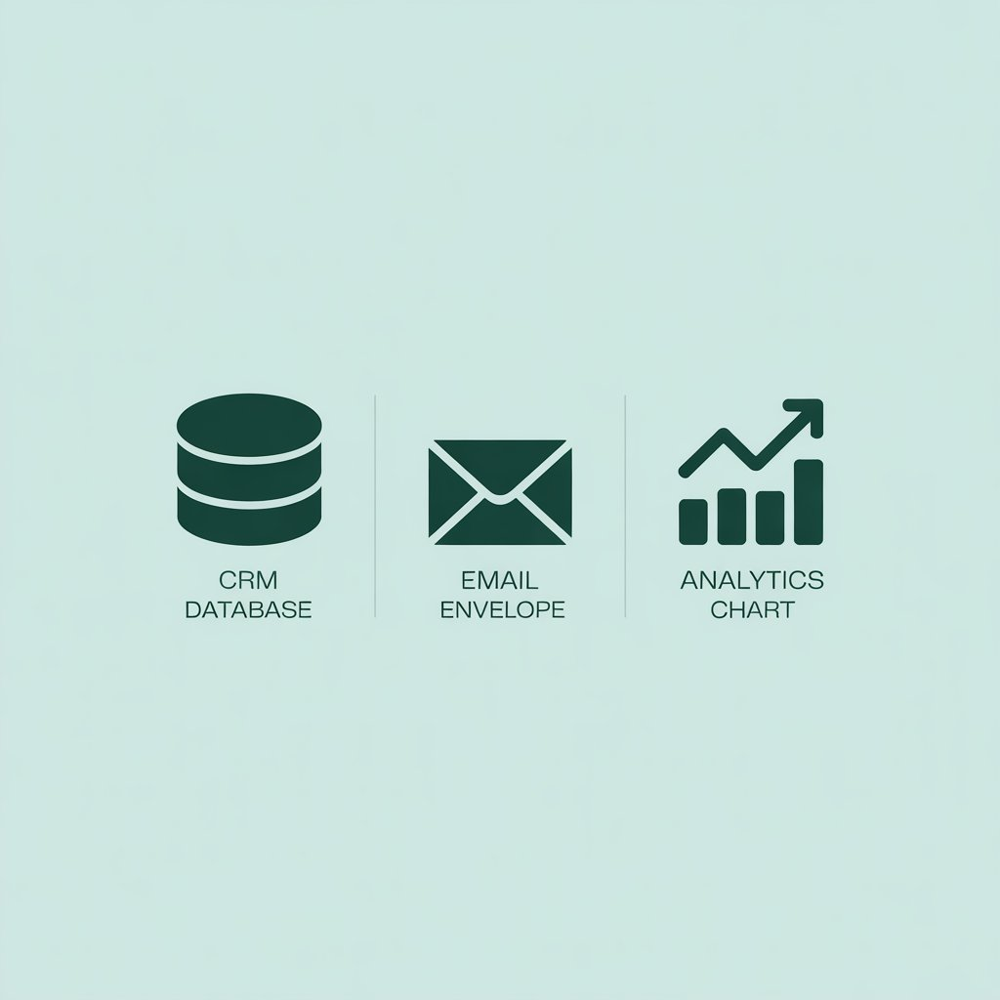
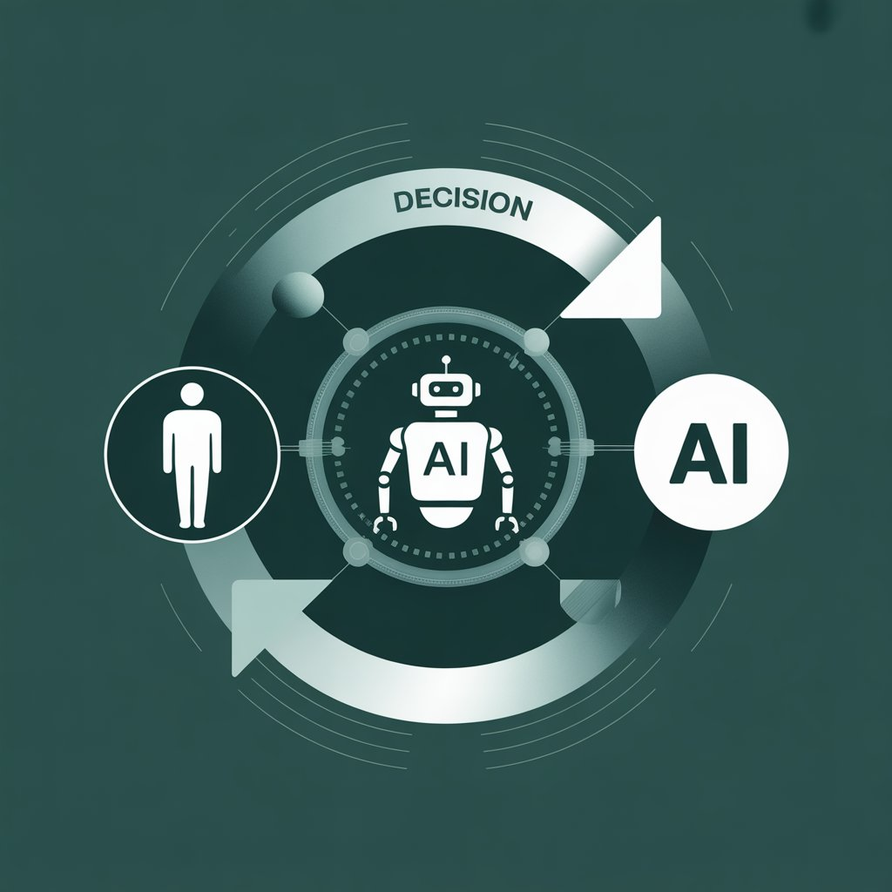

## Распространенные ошибки при выборе инструментов и их последствия

Когда речь заходит о том, какие инструменты маркетинга действительно нужны бизнесу, многие компании действуют по одному сценарию: маркетинговый отдел или подрядчик подключает одновременно несколько систем автоматизации со схожим функционалом. Совокупный ежемесячный чек за подписки достигает десятков тысяч рублей, при этом внятного обоснования для каждой платформы нет. Причина — отсутствие предварительного аудита процессов перед закупкой софта. Инструмент приобретается «на вырост» или потому что он активно обсуждается в профессиональной среде, без привязки к конкретной операционной задаче.

Опыт работы с сегментом B2B с выручкой до 2 млрд рублей показывает: корень проблемы не в качестве самих платформ, а в отсутствии измеримой гипотезы. Собственник или директор по маркетингу должен четко понимать, какой именно этап воронки требует усиления. Если такой ясности нет, любое внедрение из инструмента роста превращается в статью дополнительных расходов.

Второй принципиальный момент — игнорирование различий в моделях потребления B2B и B2C. Цикл сделки в корпоративном сегменте длится неделями и месяцами. Здесь инструменты маркетинга продаж должны работать на накопление экспертного капитала и прогрев аудитории. Импульсивное тестирование каналов, допустимое в рознице, в сложном B2B ведет к нерелевантным лидам и перегрузке отдела продаж.

## Как определить ключевые инструменты маркетинга для вашего бизнеса

Использование инструментов маркетинга тогда дает отдачу, когда выбор платформы — финальная точка логической цепочки. Придерживаюсь алгоритма из четырех шагов.

1. **Определение точки роста.** Необходимо детально разобрать текущую воронку. Где происходит максимальный отток: на этапе привлечения трафика, обработки заявки или удержания клиента? Конкретная цифра воронки — единственный объективный источник требований к инструментарию.
2. **Анализ цикла сделки.** Для B2B со средним циклом закрытия 3–6 месяцев критически важны системы автоматического прогрева (email-цепочки, контент-маркетинг) и CRM с контролем длинных лидов. В B2C приоритет смещен в сторону скорости реакции и персонализации (чат-боты, AI-оптимизация рекламы).
3. **Приоритезация по ресурсам.** Покупать enterprise-решение при одном штатном маркетологе нецелесообразно. Масштаб системы должен соответствовать текущей пропускной способности команды.
4. **Валидация на малом объеме данных.** Прежде чем интегрировать дорогостоящий сервис, проверьте его эффективность на урезанном функционале или на отдельном сегменте базы.

### Статистический срез по отраслям

По данным Content Marketing Institute и других профильных исследований за 2024–2025 год, распределение эффективности каналов выглядит так:
- SEO-продвижение: 16% вклада в общую результативность.
- Платные социальные каналы: 14%.
- Email-маркетинг: 14%.
- Контент-маркетинг: 14%.

При этом инструменты продвижения в маркетинге сложных промышленных ниш и индивидуального производства имеют свою специфику. Усредненные показатели служат лишь референсом. На практике вес органического поиска или отраслевых маркетплейсов может быть кратно выше социальных медиа.

**Минимально жизнеспособный стек для старта.**

Вне зависимости от отрасли, на начальном этапе фиксирую необходимость трех компонентов:
- **Система учета лидов:** CRM или структурированная Google/Яндекс Таблица. Стоимость внедрения на первом этапе — 0 руб.
- **Платформа email-рассылок:** Unisender, Notisend или аналог. Тариф до 1 000 руб.
- **Счетчик веб-аналитики:** Яндекс.Метрика.

Совокупные расходы не превышают 3 000 рублей в месяц. Этого контура достаточно для фиксации воронки и проверки маркетинговых гипотез. Масштабирование инструментов запускается только при двукратном росте нагрузки на ручные операции.

## Инструменты управления маркетингом: когда и как их внедрять

Переход к полноценной автоматизации управления должен быть оправдан операционными перегрузками. Практика показывает: если менеджер ежедневно тратит более 20 минут на подготовку ручного отчета по рекламным кампаниям — это сигнал к внедрению дашбордов и сквозной аналитики.

**Пример 1: AI-оптимизация рекламы.**

Отраслевое исследование эффективности ИИ-инструментов за второй квартал 2025 года демонстрирует измеримый эффект от применения алгоритмов машинного обучения в категории «Сервисы и услуги». Снижение стоимости клика (CPC) составило 34%, стоимость первичных конверсий сократилась на 36%. В сегменте «Отели» падение стоимости конверсии достигло 4,3 раза.

Важно: эти цифры актуальны для ситуаций, где накоплен большой массив данных для обучения модели. При запуске нового продукта с нуля ручное управление остается точнее.

**Пример 2: Единая CRM-экосистема.**

Крупный международный 3PL-оператор провел интеграцию CRM с полным охватом маркетингового, сбытового и сервисного контура. Результаты:
- Рост конверсии с 16% до 20%.
- Сокращение времени закрытия сделки на 60%.
- Уменьшение ручного документооборота на 22%.

Ключевой вывод здесь — не в конкретном вендоре, а в принципе «единого окна». Когда данные о звонках, заявках с сайта и переписке разрознены, менеджмент теряет управляемость. Это напрямую влияет на инструменты отдела маркетинга: они перестают давать достоверную картину.

## Роль сквозной аналитики в оценке эффективности

Среди собственников бизнеса с оборотом от 200 млн рублей до сих пор встречается мнение, что глубокая аналитика — удел IT-департамента. Это заблуждение обходится дороже всего. Наличие рекламного бюджета без сквозной цепочки от клика до отгрузки товара превращает маркетинг в работу с «черным ящиком».

До внедрения сквозной аналитики система веб-метрики в типичном интернет-магазине отражает менее 52% фактических заказов. Искажение возникает из-за некорректной передачи данных из ERP или CRM обратно в системы статистики. Управленческие решения о перераспределении бюджета принимаются на основе неполной выборки.

После настройки синхронизации удается связать 93% транзакций с источниками переходов. Это позволяет:
- Выявить каналы с отрицательным ROMI.
- Перераспределить бюджеты в пользу рентабельных сегментов.
- Снизить зависимость от субъективных оценок.

**B2B-кейс: производитель оборудования.**

Инжиниринговая компания, работавшая одновременно через офлайн-выставки и интернет-каналы, столкнулась с отсутствием единой картины по всем источникам лидов. Внедрение платформы сквозной аналитики и коллтрекинга заняло 14 рабочих дней. Результаты:
- Доля нецелевых обращений снизилась в 1,7 раза.
- Продажи выросли на 157% за счет перераспределения нагрузки с неэффективных каналов.
- Показатель отказов на входящих звонках сократился на 22%.

При оценке окупаемости в B2B критичен горизонт расчета. ROMI первого месяца после запуска технологии почти всегда отрицательный — сказывается длинный цикл сделки. Корректная оценка эффективности аналитических систем в этом сегменте возможна на дистанции 9–12 месяцев.

## Инструменты современного маркетинга: прогноз на 2025–2026

Развитие технологий в ближайшие два года изменит ландшафт маркетинга сильнее, чем предыдущие пять лет. Четыре направления, которые станут основой для инструмента развития маркетинга в средне- и долгосрочной перспективе.

**1. Рынок A2A (Agent-to-Agent).**
Взаимодействие смещается с человеческого на машинный уровень. AI-ассистенты становятся новым контуром целевой аудитории. По данным Gartner, к концу 2026 года доля запросов через AI-интерфейсы в России превысит 60%. Маркетинговые материалы должны проектироваться так, чтобы быть релевантными и для человека, и для алгоритма, который принимает решение за человека.

**2. Инфраструктурная роль ИИ.**
Генеративные модели перестают быть надстройкой и становятся ядром платформ автоматизации. Компании столкнутся с дилеммой: скорость производства сотен креативов против контроля качества и риска некорректной информации в B2B-документации.

**3. Смещение фокуса на LTV.**
Стоимость привлечения нового клиента в ряде B2B-ниш приближается к маржинальности первой сделки. Бюджет будет перетекать в инструменты управления клиентским опытом и программы лояльности. Аналитика удержания становится приоритетнее аналитики трафика.

**4. Капитализация доверия.**
В условиях информационной перегрузки и роста дипфейков прозрачность данных и фактчекинг превращаются в экономический актив. Инструменты верификации контента и управления репутацией будут востребованы так же, как сегодня SEO-платформы.

### Краткое резюме для внедрения

1. Аудит процессов предшествует выбору платформы. Основные инструменты маркетинга решают конкретные задачи, а не «улучшают маркетинг в целом».
2. Базовый стек для фиксации воронки и проверки гипотез — CRM, email, аналитика — требует не более 3 000 руб. в месяц. При росте нагрузки подключаются платные модули и новые сервисы.
3. Интеграция сквозной аналитики обязательна при медийных бюджетах свыше 300 000 руб. в месяц. Без нее компания инвестирует в рекламу, не понимая реальной стоимости сделки.
4. Автоматизацию на базе AI следует внедрять только при наличии достаточной исторической выборки данных.
5. Инструменты маркетинга компании должны отбираться под бизнес-модель, а не под абстрактный рейтинг платформ.

Такой подход позволяет исключить неэффективные расходы и выстроить маркетинговую систему, готовую к масштабированию.
