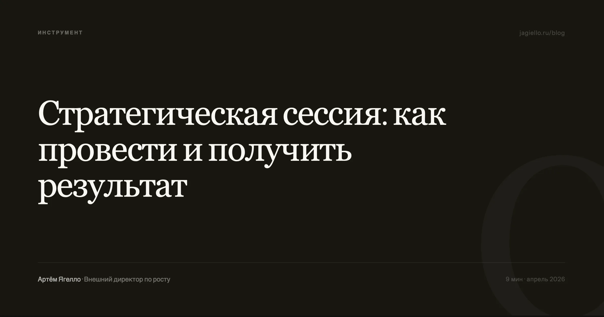

По моему наблюдению, частая проблема — когда стратегическая сессия проходит, все расходятся воодушевлённые, а через месяц никто не может вспомнить, о чём договаривались. Это не вина конкретного ведущего или команды, а системный результат: проведение стратегической сессии подменяется процессом, и успех измеряется не принятыми решениями, а количеством исписанных флипчартов.

Большинство компаний проводят стратсессию ради самого факта её проведения. Собственник чувствует, что надо что-то менять, но вместо того чтобы взять ответственность за непопулярные решения, приглашает консультанта, который красиво фасилитирует обсуждение, а через месяц всё возвращается на круги своя. Проблема не в инструменте — стратегическая сессия может быть мощнейшим рычагом. Проблема в том, как её готовят и кто её ведёт.

## Почему большинство стратегических сессий не дают результата

Первое, что я спрашиваю у собственника перед тем, как планировать проведение стратегической сессии: «Какое самое трудное решение вы готовы принять по итогам?» Если ответ размытый — «ну, мы определим вектор» или «посмотрим, что команда предложит» — я сразу говорю: сессия не нужна. Стратегическая сессия — это не brainstorming и не team building. Это пространство для принятия конкретных, часто жёстких решений, которые собственник по каким-то причинам не может принять единолично.

**Нет настоящей цели.** Когда цели формулируются как «выработать стратегию» или «сформулировать видение» — это звучит правильно, но не работает. Стратегия не вырабатывается за два дня. За два дня можно принять два-три ключевых решения, для которых нужен прямой диалог между собственником и командой. Если таких решений нет, стратсессия превращается в ритуал.

**Неправильный состав участников.** Собственник приглашает «проверенных» людей, с которыми комфортно, а не тех, кто будет спорить. Или зовёт весь топ-менеджмент, включая тех, кто не влияет на стратегические решения. Состав участников — это первое стратегическое решение, которое принимается ещё до старта.

**Смешение стратегического и операционного.** Как только начинают обсуждать, почему в прошлом квартале упали продажи или кто виноват в срыве сроков — стратегическая сессия заканчивается. Одна из задач фасилитатора — жёстко удерживать фокус на горизонте двух-трёх лет, а не двух месяцев.

## Три признака правильно спроектированной сессии

Цели стратегической сессии — это не список тем. Это список вопросов, на которые у компании нет ответа, но она готова их найти. Если таких вопросов нет — сессия не нужна.

**Первый.** У сессии есть конкретный вопрос, на который нельзя ответить односложно, но можно выйти на решение за отведённое время. Не «куда мы идём», а «какой из двух клиентских сегментов мы выбираем приоритетным и от какого отказываемся». Чем уже вопрос, тем выше шанс уйти с решением.

**Второй.** В комнате есть люди, которые не согласны друг с другом. Если все кивают — это не стратегическая сессия. Хороший ведущий позаботится о том, чтобы разногласия проявились, а не остались в кулуарах.

**Третий.** Собственник готов услышать то, что ему не понравится. Это самое трудное. Если собственник приходит с уже готовым решением и ждёт, что команда его одобрит — сессия не нужна. Достаточно просто поставить задачу сверху.

## Фасилитация: кто такой ведущий и зачем он нужен

Роль ведущего стратегической сессии часто недооценивают. Кажется, что если собственник сам проведёт встречу — сэкономит бюджет и сделает разговор более доверительным. На практике происходит обратное: собственник не может быть одновременно участником дискуссии и модератором. Его мнение доминирует, команда подстраивается, реальные разногласия не всплывают.

Хороший фасилитатор не просто управляет очередностью выступлений. Он улавливает момент, когда группа уходит в защиту или избегает острой темы. Он фиксирует не только то, что сказано, но и то, о чём молчат. Он задаёт вопросы, которые собственник не может задать своим подчинённым, потому что те будут искать «правильный» ответ, а не честный.

Ведущий помогает отделить факты от интерпретаций. Когда коммерческий директор говорит «рынок падает, поэтому мы не растём», фасилитатор спрашивает: «На сколько процентов упал рынок? А на сколько упали продажи у конкурентов? А у нас?» Часто выясняется, что рынок упал на 5%, а продажи компании — на 15%, и дело не в рынке. Без внешнего ведущего такой разговор редко случается.

<strong>Про онлайн-формат.</strong> Онлайн-стратсессия при грамотной подготовке работает не хуже очной, особенно если команда распределённая. Важно не место, а концентрация: участники должны на два дня выключиться из операционки — независимо от того, где физически находятся.

## Организация: четыре этапа подготовки

01

Сбор данных — за 2–3 недели

Финансовые показатели за два года, структура выручки по продуктам и каналам, результаты клиентских опросов. Без цифр стратегическая сессия превращается в обмен мнениями, где каждый прав, потому что нет объективной картины.

02

Предварительные интервью с каждым участником

Я всегда разговариваю с каждым по отдельности до сессии. Это даёт реальные разногласия в команде, позицию без оглядки на начальника, и материал для сценария. Хороший фасилитатор знает, в какой момент на сессии возникнет напряжение — потому что уже видел его на интервью.

03

Проектирование сценария

Не жёсткий тайминг с поминутным расписанием, а два-три ключевых вопроса с промежуточными точками. Сценарий — это маршрут, а не расписание электрички.

04

Подготовка к внедрению — до начала сессии

Ещё до старта нужно договориться, кто и в какие сроки отвечает за исполнение решений. Если приняли решение о запуске нового продукта — должен быть назван ответственный, срок и контрольная точка. Без этого стратсессия останется в воспоминаниях как «было интересно, но ничего не изменилось».

## Типичные ошибки собственников

Приглашать только «своих»

Собственнику комфортно с людьми, которым он доверяет. Но стратегическая сессия для того и нужна, чтобы выйти из зоны комфорта. Если в комнате нет человека, который скажет «я не согласен, это не сработает» — ценность сессии стремится к нулю. Иногда достаточно пригласить руководителя среднего звена, который работает с клиентами напрямую.

Пытаться решить слишком много за раз

Собственник копит проблемы месяцами, а потом хочет разобрать их все за два дня. Так не работает. Лучше одна сессия с тремя решениями, чем три сессии без единого.

Не готовить команду

Собственник думает, что команда «в теме», но на сессии выясняется, что маркетинг не знает планов производства, а финансы не видели новую модель ценообразования. Разрыв в информированности убивает дискуссию. За неделю до сессии все участники должны получить пакет данных — цифры, аналитику, результаты опросов клиентов.

## Как изменится проведение стратсессий

**Сокращение длительности.** Два полных дня с выездом за город всё чаще заменяются однодневными сессиями. Причина простая: собственники не готовы выключаться из бизнеса на двое суток, а качество решений при правильной подготовке не зависит от длительности.

**Данные в реальном времени.** Если раньше на сессии оперировали данными двухмесячной давности, то сейчас можно вывести актуальную аналитику: конверсию по каналам, динамику оттока, юнит-экономику. Это переводит разговор из области предположений в область фактов.

**Рост спроса на внешних фасилитаторов.** Собственники всё чаще понимают, что внутренний модератор неэффективен. Внешний человек может задать вопрос, который внутренний не задаст никогда.

Стратегическая сессия — это не событие, а инструмент. Как любой инструмент, она работает только в руках того, кто знает зачем её проводит, и готов отвечать за последствия принятых решений. Всё остальное — декор.

