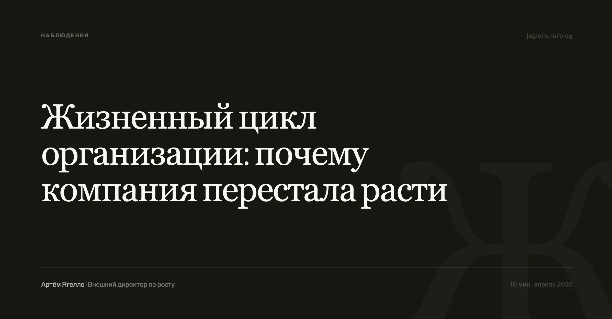
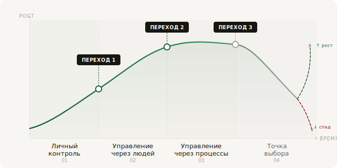

Компании среднего размера редко умирают от внешних причин. Чаще они теряют связь с рынком изнутри — пока заняты собой. Собственник перестаёт разговаривать с ключевыми клиентами, информация фильтруется на каждом уровне, решения замедляются. Это почти всегда означает одно: бизнес перешёл на новую стадию, а способ управления остался прежним.

## Стадии жизненного цикла организации

Стадии жизненного цикла организации — это не просто размер и возраст. Это способ, которым компания принимает решения и получает обратную связь от рынка.

На практике я выделяю не абстрактные «зарождение, рост, зрелость», а конкретные состояния по одному признаку: где живёт ключевая экспертиза и как она передаётся.

01

Экспертиза в голове собственника

Он знает клиентов лично, принимает решения быстро, реагирует на рынок интуитивно. Управление держится на доверии и прямых указаниях. Попытка внедрить на этом этапе сложные регламенты или многоуровневое согласование убивает скорость — единственное конкурентное преимущество этой стадии.

02

Передача вниз

Собственник физически не успевает закрывать все контакты. Появляются руководители направлений. Главная ловушка — наём «своих» вместо компетентных. Лояльность начинает цениться выше профессионализма. Это напрямую бьёт по качеству работы с клиентом.

03

Формализация

Есть средний менеджмент, KPI, регламенты. Главный риск — не бюрократия, а другое: собственник перестаёт принимать решения сам. Вместо чёткой позиции — бесконечные обсуждения с директорами. Компания зависает неделями не потому что процессы плохие, а потому что человек наверху перестал быть точкой принятия ответственности.

04

Точка выбора

Компания либо находит новую ценность для рынка и пересобирает модель, либо медленно теряет позиции. Самый болезненный этап — команда привыкла к стабильности и воспринимает изменения как угрозу.

## Модель жизненного цикла организации

Классическая модель — Адизес, Грейнер — это полезная диагностическая рамка, но не инструкция к действию. Симптомы на разных стадиях похожи, а причины — разные.

Когда компания замедлилась и теряет клиентов, это может быть признаком трёх разных вещей: перегрузки собственника, слабого среднего менеджмента или паралича принятия решений. Лечение в каждом случае противоположное. Модель подскажет что что-то не так. Что именно — нужно смотреть отдельно.

Ни одна модель не учитывает три вещи, критически важные для среднего бизнеса:

- **Личность собственника.** Если он не готов отпускать операционный контроль — никакая структура не поможет. Я видел: выстраивалась оргструктура, нанимались сильные руководители, собственник соглашался. Через месяц снова забирал ключевые решения на себя.
- **Динамика рынка.** Жизненный цикл компании всегда вложен в жизненный цикл отрасли. Если рынок падает, внутренние изменения помогут сохранить маржу, но не дадут роста выручки.
- **Состояние команды.** Компания может вести себя как зрелая, даже если по цифрам она на стадии роста — если ключевые люди выгорели. Иногда замена одного человека даёт больше, чем полгода перестройки структуры.

## Теория против практики

Теория жизненного цикла ценна не ответами, а вопросами: на какой мы стадии, какие риски у этой стадии, что будет дальше. Когда эти вопросы превращаются в догму — начинаются проблемы.

Производственная компания с выручкой около 800 млн упёрлась в потолок. Консультанты поставили диагноз по стадии, начали строить оргструктуру и внедрять ERP. Через год выручка не выросла, операционные расходы выросли на 15%. Проблема оказалась в другом: 80% оборота давали клиенты с маржинальностью 5%, а направление с маржинальностью 25% не развивалось вообще. Стадия жизненного цикла тут ни при чём.

Обратная крайность: собственник видит падение выручки и списывает на «стадию спада». Начинаются разговоры о ребрендинге, новой миссии, стратсессиях. А на деле команда просто потеряла тонус, и нужна жёсткая операционная работа. Подмена диагноза моделью здесь опаснее самой проблемы.

## Три перехода, на которых компании ломаются

Жизненный цикл бизнеса — не плавное движение по кривой. Это череда переходов, каждый из которых создаёт точку максимального риска. На каждом переходе компания наступает на один и тот же тип ошибки: пытается решить новую проблему старым инструментом.

**Переход 1. От личного контроля к управлению через людей.** Собственник нанимает первых руководителей. Главная ошибка — не в том, кого нанимают, а в том, что не меняют систему мотивации и отчётности. Новый руководитель получает власть, но не инструменты контроля. Через полгода — дополнительный управленческий слой, который потребляет деньги, но ничего не изменил.

**Переход 2. От управления через людей к управлению через процессы.** Компания нанимает консультантов, те пишут регламенты. Сотрудники тратят значительную часть времени на согласование и отчётность. Компания начинает обслуживать систему, а не клиента. Выручка может стагнировать даже на растущем рынке.

**Переход 3. От процессного управления к новому предпринимательству.** Нужна новая энергия: выделение внутренних стартапов, выход в новые ниши, смена ключевых людей. Без внешнего импульса этот переход не происходит — структура и инерция сопротивляются сами по себе.

## Что меняется с каждой стадией

Главное, что меняется — не структура, а логика принятия решений.

На ранней стадии правильное решение — то, которое принято быстро, основано на личном знании клиента и не требует согласования. На системной стадии правильное решение — то, которое прошло через процедуру и не создаёт прецедента. Это противоположные логики. Когда компания застряла на переходе — она пытается совмещать обе и не получает ни скорости, ни надёжности.

Стадии развития компании определяют, где живёт конкурентное преимущество. На ранней стадии — в скорости и личных отношениях. На функциональной — в умении делегировать без потери качества. На системной — в способности управлять сложностью и не терять клиента за регламентами. На стадии обновления — в смелости признать, что прежняя модель больше не работает.

Самый опасный момент — не кризис, а эйфория от успеха на очередной стадии. Когда кажется, что система выстроена идеально и можно расслабиться. Именно в этот момент компания начинает терять связь с рынком — медленно, незаметно, пока падение не становится очевидным для всех.

